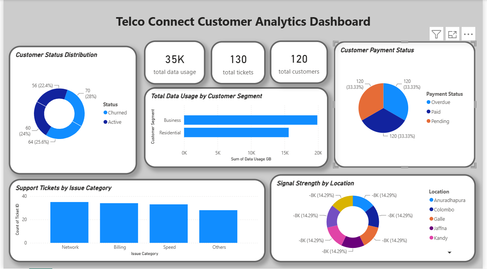
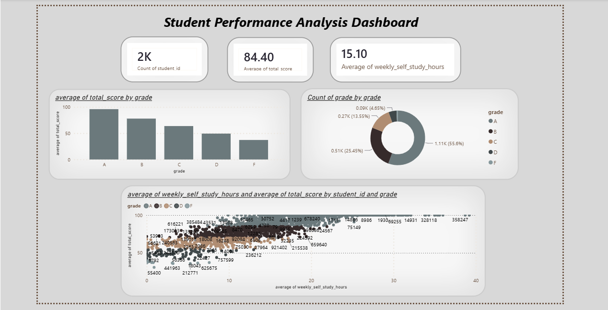

# Hi there, I'm Swetha Mahendran 👋
> IT student focused on software development, data analytics, and practical learning. Currently seeking an IT internship to apply and expand my skills.

## Table of Contents
- [About Me](#about-me)
- [Skills](#skills)
- [Projects](#projects)
- [Certifications & Learning](#certifications--learning)
- [Extracurriculars](#extracurriculars)
- [Contact](#contact)
- [Next Steps / How You Can Help](#next-steps--how-you-can-help)

---

## About Me
- 🎓 Foundation in Information Technology & Business Management — BCAS Campus, Kandy, Sri Lanka  
- 💼 Seeking an IT internship to gain hands-on experience in software development and analytics  
- 🌱 Lifelong learner: I combine coursework with self-study and small projects to build practical skills  
- 🗣️ Languages: English, Tamil, Sinhala

---

## Skills

**Programming**

**Data & Analytics**

**Database**

**Web**

**Tools**

---

## Projects
(Click project titles to open the repo)

- **[Expense Tracker](https://github.com/swethamahendren94-oss/expense-tracker-java-python)** — Java console app to log expenses + Python analysis script to visualize spending (pie charts).  
  Tech: Java, Python, pandas, matplotlib

- **Telco Connect Customer Analytics Dashboard** — interactive Power BI dashboard analyzing customers, subscriptions, support tickets, and usage patterns.  
  Tech: Power BI  
  

- **Student Performance Analysis Dashboard** — analyzed 2,000 students using SQL + Excel; built an interactive Power BI dashboard and discovered study hours correlate strongly with performance.  
  Tech: SQL, Excel, Power BI  
  

---

## Certifications & Learning
| Certificate | Platform | Year |
|-------------|----------|------|
| Introduction to Java | Sololearn | 2026 |
| Introduction to Software Testing | Coursera (University of Minnesota) | 2026 |

Currently learning:
- OOP fundamentals, Git & GitHub, Power BI dashboard best practices

---

## Extracurriculars
- Prefect — School Board of Prefects  
- Member — School western band group  
- Participant — School athletics and cultural programs

---

## Contact
- Email: [swethamahendren94@gmail.com](mailto:swethamahendren94@gmail.com)  
- LinkedIn: [linkedin.com/in/mahendren-swetha](https://www.linkedin.com/in/mahendren-swetha-80a7b5347)

---

## Next Steps / How You Can Help
- If you're a recruiter: I'm open to internship opportunities — drop me a message on LinkedIn or email.  
- If you're a mentor: I welcome feedback on my projects and suggestions for improvement.

---

## GitHub Stats

---
_Last updated: 2026-08-13_
